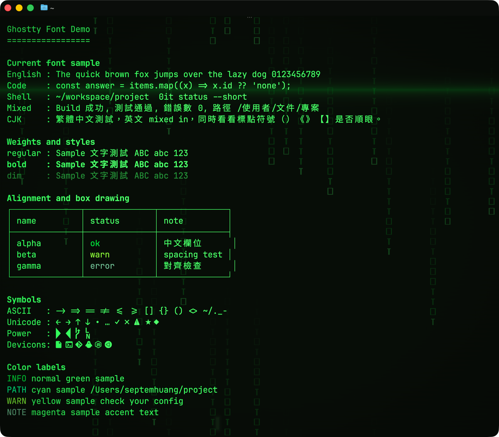
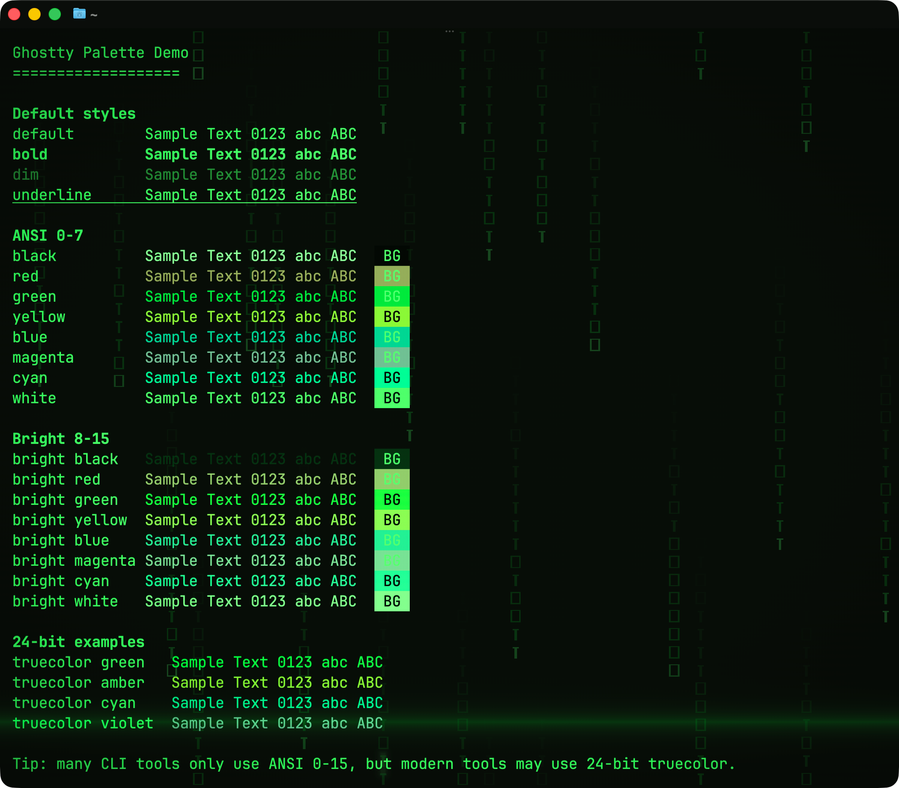

# Ghostty Matrix Theme

Matrix-inspired Ghostty theme for macOS with readable green-on-black colors,
clearer ANSI semantics, `JetBrains Mono` + `Sarasa Mono TC`, and subtle
shader-based digital rain.

This repo is free to use, modify, and share under the MIT License.

## Highlights

- Readable Matrix-style terminal colors, not pure monochrome green
- Traditional Chinese-friendly font setup
- Custom shaders for CRT glow, cursor halo, and faint digital rain
- Backup-first installer for the files this theme manages

## Preview

| Main | Additional |
| --- | --- |
|  |  |

## Quick Install

```bash
brew install --cask font-jetbrains-mono font-sarasa-gothic
git clone git@github.com:septemfun1990/ghostty-matrix-theme.git
cd ghostty-matrix-theme
./install.sh
```

Then fully quit and reopen Ghostty.

This repository is intended to be enough for moving the Matrix theme itself
between macOS machines. It includes the Ghostty config that defines the theme,
the two shaders the theme depends on, and an installer that copies them into
Ghostty's standard config directory.

It does not bundle font files or preserve unrelated Ghostty settings. If the
target machine does not have the same fonts installed, or if you need to merge
this with another custom Ghostty config, extra work is still required.

## Files

- `asset/`: preview screenshots for GitHub
- `config`: Ghostty config
- `SKILL.md`: AI-agent oriented install instructions
- `shaders/matrix_display.glsl`: display shader with faint digital rain
- `shaders/matrix_cursor_halo.glsl`: cursor glow / pulse shader
- `install.sh`: copy files into the standard Ghostty config location

## Install

Standard install:

```bash
./install.sh
```

Safe preview:

```bash
./install.sh --dry-run
```

Manual install:

```bash
mkdir -p ~/Library/Application\ Support/com.mitchellh.ghostty/shaders
cp config ~/Library/Application\ Support/com.mitchellh.ghostty/config
cp shaders/*.glsl ~/Library/Application\ Support/com.mitchellh.ghostty/shaders/
```

## License

This theme is open for public use under the MIT License. You can use it,
modify it, and redistribute it freely. See [LICENSE](LICENSE).

## What This Repo Covers

- Theme colors and window styling
- Font family choices used by this theme
- Cursor styling
- Matrix shaders and shader animation settings
- A backup-first installer for the theme files it manages

## What This Repo Does Not Cover

- Font binaries
- Shell prompt or Nerd Font icon compatibility
- Non-theme Ghostty preferences you may want to merge manually
- Validation success on every machine or every Ghostty build

## Backup Behavior

`install.sh` now backs up any existing managed files before overwriting them:

- `~/Library/Application Support/com.mitchellh.ghostty/config`
- `~/Library/Application Support/com.mitchellh.ghostty/shaders/matrix_display.glsl`
- `~/Library/Application Support/com.mitchellh.ghostty/shaders/matrix_cursor_halo.glsl`

Backups are written to:

```bash
~/Library/Application Support/com.mitchellh.ghostty/backups/<timestamp>/
```

If you need to restore, copy the backup files back into the standard Ghostty
config directory.

## For AI Agents

If another AI agent needs to install or update this setup, have it read `SKILL.md` first and then run:

```bash
./install.sh
```

After installation, validate with:

```bash
'/Applications/Ghostty.app/Contents/MacOS/ghostty' +validate-config
```

If validation fails in a headless or restricted environment, install can still
be correct. In that case, restart Ghostty and verify visually inside the app.

## Fonts

- `JetBrains Mono`
- `Sarasa Mono TC`

Homebrew example:

```bash
brew install --cask font-jetbrains-mono font-sarasa-gothic
```

## Notes

- `background-opacity` and some macOS window settings are best applied after a full restart.
- The config expects the shaders to live in:
  `~/Library/Application Support/com.mitchellh.ghostty/shaders/`
- If your prompt depends on Nerd Font icons, switch the primary font to a Nerd Font build.
